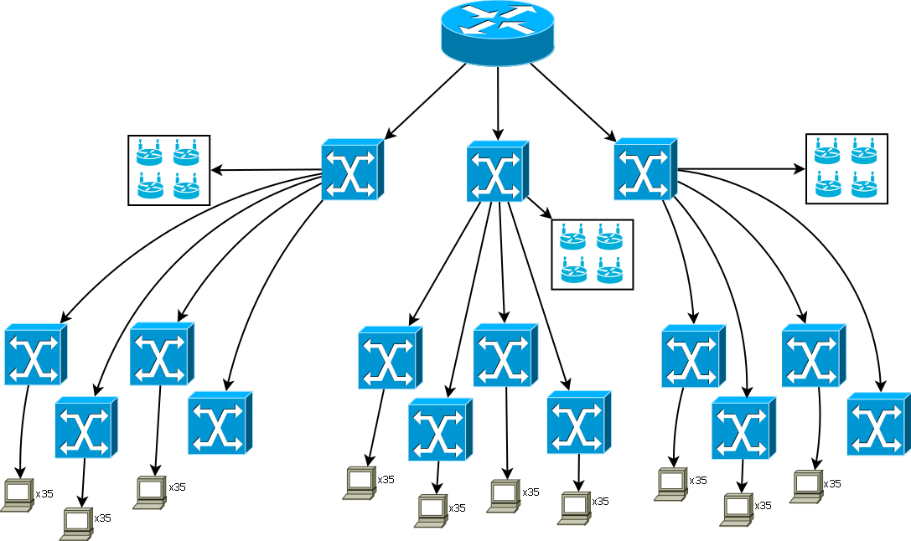

Poziom 0
----------------------------------------------------------
|Sala   |Adres podsieci  |Maska podsieci    |Adres rozgłoszeniowy   |Adres pierwszego hosta|Adres ostatniego hosta|Ilość hostów  |
|-------|----------------|------------------|-----------------------|----------------------|----------------------|--------------|
|``WiFi``|172.16.0.0/22  |255.255.252.0     |172.16.3.255           |172.16.0.1            |172.16.3.254          |1022          |
|``009``|172.16.4.0/26   |255.255.255.192   |172.16.4.63            |172.16.4.1            |172.16.4.62           |62            |
|``013``|172.16.4.64/26  |255.255.255.192   |172.16.4.127           |172.16.4.65           |172.16.4.126          |62            |
|``014``|172.16.4.128/26 |255.255.255.192   |172.16.4.191           |172.16.4.129          |172.16.4.190          |62            |
|``017``|172.16.4.192/26 |255.255.255.192   |172.16.4.255           |172.16.4.193          |172.16.4.254          |62            |

Poziom 1
------------------------------------------------------------------------------
|Sala    |Adres podsieci  |Maska podsieci    |Adres rozgłoszeniowy   |Adres pierwszego hosta|Adres ostatniego hosta|Ilość hostów  |
|--------|----------------|------------------|-----------------------|----------------------|----------------------|--------------|
|``WiFi``|172.16.10.0/22  |255.255.252.0     |172.16.13.255          |172.16.10.1           |172.16.13.254         |1022          |
|``115`` |172.16.14.0/26   |255.255.255.192  |172.16.14.63           |172.16.14.1           |172.16.14.62          |62            |
|``116`` |172.16.14.64/26  |255.255.255.192  |172.16.14.127          |172.16.14.65          |172.16.14.126         |62            |
|``117`` |172.16.14.128/26 |255.255.255.192  |172.16.14.191          |172.16.14.129         |172.16.14.190         |62            |
|``122`` |172.16.14.192/26 |255.255.255.192  |172.16.14.255          |172.16.14.193         |172.16.14.254         |62            |

Poziom 2
----------------------------------------------------------
|Sala   |Adres podsieci  |Maska podsieci    |Adres rozgłoszeniowy   |Adres pierwszego hosta|Adres ostatniego hosta|Ilość hostów  |
|-------|----------------|------------------|-----------------------|----------------------|----------------------|--------------|
|``WiFi``|172.16.20.0/22 |255.255.252.0     |172.16.23.255          |172.16.20.1           |172.16.23.254         |1022          |
|``201``|172.16.24.0/26  |255.255.255.192   |172.16.24.63           |172.16.24.1           |172.16.24.62          |62            |
|``202``|172.16.24.64/26 |255.255.255.192   |172.16.24.127          |172.16.24.65          |172.16.24.126         |62            |
|``203``|172.16.24.128/26|255.255.255.192   |172.16.24.191          |172.16.24.129         |172.16.24.190         |62            |
|``204``|172.16.24.192/26|255.255.255.192   |172.16.24.255          |172.16.24.193         |172.16.24.254         |62            |

